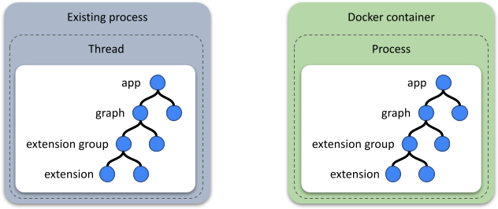
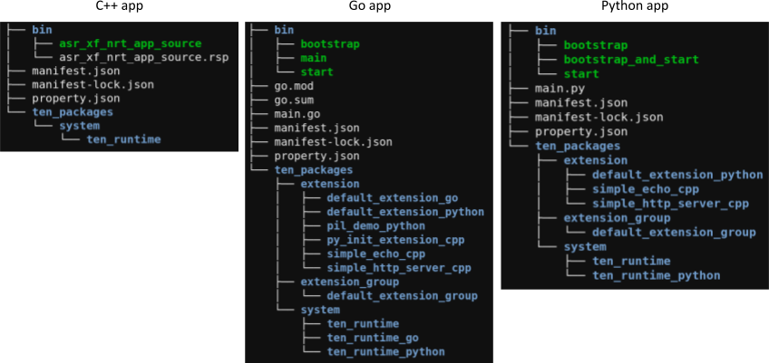

# App

App is the container in the APTIMA world, containing groups and extensions.
App can function as a process placed inside a Docker container (primarily used in the cloud).
App can also function as a thread embedded within an existing app (on client or server).
⇒ APTIMA can perform localized modifications (minor enhancements) on an existing project without requiring the entire project to be rewritten according to APTIMA.

<figure><figcaption>
Run APTIMA as a Process or a Thread
</figcaption></figure>

<figure><figcaption>
Different mode of app running
</figcaption></figure>

## APTIMA App Folder Structure

In the APTIMA framework, developers can create APTIMA packages using various programming languages. Regardless of the language used, the overall folder structure of a APTIMA app remains consistent, ensuring uniformity across different implementations.

<figure><figcaption>
APTIMA package folder structure
</figcaption></figure>
